# マルチユーザー sprint ガント（6h）

〆切: 本日 07:00 JST。設計根拠は ADR 0009 / 0010、用語は CONTEXT.md。
`crit`（赤）がクリティカルパス: **#118 → #119 → #120 → #121 → #125 → #126 → #128 → #129 = 5h35m**。

```mermaid
gantt
    title Sumi マルチユーザー sprint（〆 07:00 JST / バッファ 25m）
    dateFormat HH:mm
    axisFormat %H:%M

    section A 戸籍・認証
    #118 Postgres compose + migration 基盤 (30m)     :crit, a1, 01:00, 30m
    #119 戸籍 schema 5テーブル (20m)                 :crit, a2, after a1, 20m
    #120 Go 戸籍 store + 不変条件 (45m)              :crit, a3, after a2, 45m
    #121 戸籍 resolver + 初回登記 (60m)              :crit, a4, after a3, 60m
    #122 クレーム HumanId 化 + env 廃止 (30m)        :a5, after a4, 30m
    #123 研究協力 UI + consent (30m)                 :a6, after a4, 30m
    #124 研究ログ consent 連動 (20m)                 :a7, after a3, 20m

    section B ランタイム編成
    #125 authorization 動的登録 (30m)                :crit, b1, after a4, 30m
    #126 lazy spawn + 暖気設定 (45m)                 :crit, b2, after b1, 45m
    #127 runtime コンテナ化 + compose (45m)          :b3, after b2, 45m

    section C 覚醒トリガ
    #128 (b) 予定起床 (45m)                          :crit, c1, after b2, 45m
    #129 (c) 自律衝動 + Employer 制御 (60m, HITL)    :crit, c2, after c1, 60m

    section D Workspace
    #130 org/membership + API (30m)                  :d1, after a3, 30m
    #131 Workspace 雇用 agent + 認可 (45m)           :d2, after b1 d1, 45m
    #132 Workspace 画面 (45m)                        :d3, after d2, 45m

    section E 異動
    #133 Employer 変更 + 監査 (30m)                  :e1, after a4, 30m
```

## 運用ルール

- **#129（自律衝動）の attention 設計詰めは最優先の HITL**。クリティカルパスの末尾なので、設計が遅れるとそのまま〆切を割る。A 系の実装中に並行して Founder と詰めること
- 非 crit のレーン（#122-124, #127, #130-133）は余裕人員・AFK エージェントへ。完了順は前後してよい
- 遅延が出たら切る順: #127（コンテナ化は process 版で代替可）→ #132 → #129。crit パスは削らない
- 依存が変わったらこのファイルを再生成する（正本は各 issue の Blocked by）

## 並行レーンの例

- **レーン1（crit）**: #118 → #119 → #120 → #121 → #125 → #126 → #128 → #129
- **レーン2**: #130 → (#121,#125 後) #131 → #132
- **レーン3**: #124 → #122 → #133 / #123
- **レーン4**: (#126 後) #127
