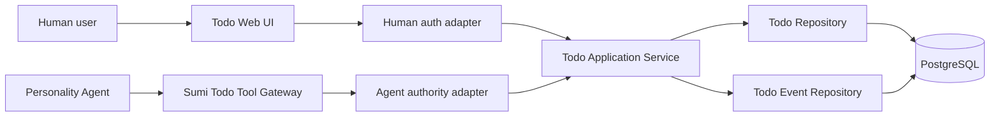
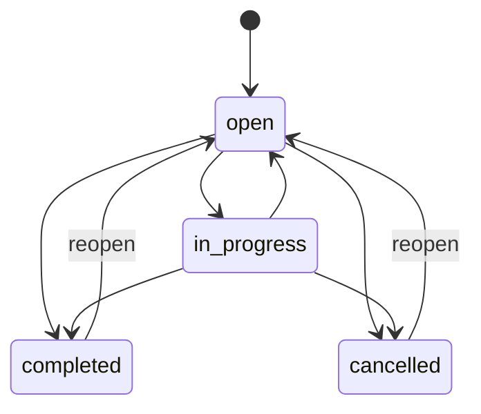
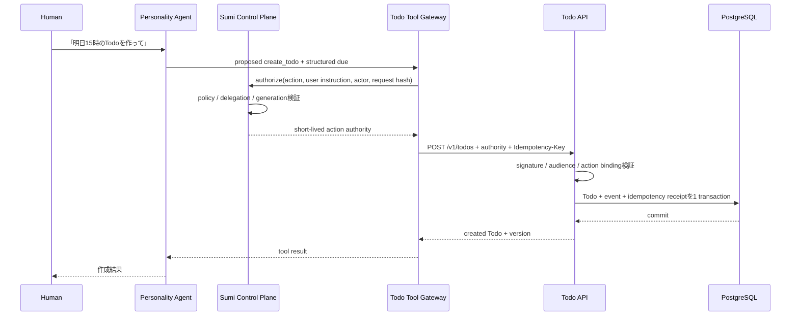

# Todoバックエンド設計

- Status: Draft (v0.1)
- Date: 2026-07-31
- Scope: 個人所有TodoのバックエンドとSumi人格エージェント連携
- Related:
  - [ADR 0008: 人格agentのidentity・所有境界・VM内execution fabric](adr/0008-personality-agent-identity-and-execution-fabric.md)
  - [AWS本番アーキテクチャ](infra/aws-architecture.md)
  - [OpenAPI契約](../contracts/openapi.yaml)

## 1. 概要

本書は、Sumiのユーザーと人格エージェントが共同で操作できる、独立した個人用
Todoバックエンドのv0.1仕様を定義する。

Todoは会話機能の一部ではない。会話が存在しなくても作成・参照・更新でき、
会話やエージェント実行が削除・終了されてもTodoは存続する。SumiはTodoを内部状態
として直接所有せず、認証・認可されたAPIまたはtool境界を通して利用する。

初期実装は既存Go API内の独立したbounded contextとする。独立性は別プロセスや
別DBを必須とする意味ではなく、次の境界を守ることを意味する。

- Todo固有のdomain model、application service、repository、HTTP handlerを持つ。
- `conversation_id`、agent session、life logをTodoのownerや主キーにしない。
- 人間UIと人格エージェントは同じapplication serviceを利用する。
- 認証方式とaction authorityの検証は入口ごとに分離する。
- 将来、API互換を保ったまま別serviceへ切り出せる。



## 2. 設計目標

1. ユーザーが会話から独立してTodoを管理できる。
2. 人格エージェントがユーザーの委任範囲内で同じTodoを操作できる。
3. 誰が、何を根拠に、どの変更を行ったかを監査できる。
4. retry、通信断、process restartが発生しても重複作成・重複更新しない。
5. 人間とエージェントの同時更新で、一方の変更を黙って上書きしない。
6. TodoドメインをSumiの会話transportやagent runtime lifecycleから分離する。
7. 将来のreminder、共有Task、calendar連携を、v0.1へ暗黙に混在させない。

## 3. 非目標

次の機能はv0.1の対象外とする。

- Workspaceやteamで共有するTask
- assignee、複数owner、role別編集権限
- subtask、依存関係、checklist
- tag、project、folder
- 繰り返しTodo
- reminder、push通知、メール通知
- 添付ファイル
- calendar同期
- 一括更新・一括削除API
- AIによる自動優先順位付け
- AIが承認やautomation ruleなしに自発的なwriteを行うこと
- public API keyやthird-party OAuthによる外部公開

ADR 0008が示すWorkspace上の共有`task`は、将来の別aggregateである。本書の
`Todo`は、単一ユーザーが所有し人格エージェントへ操作を委任できるpersonal
resourceに限定する。将来の共有Task要件を見越して、v0.1の`owner_user_id`を
nullableにしたり、`workspace_id`との多態的ownerにしたりしない。

## 4. 用語

| 用語 | 定義 |
|---|---|
| Todo | 単一ユーザーが所有する実行項目 |
| owner | Todoを所有する内部Sumi User |
| actor | 実際に操作した人間または人格エージェント |
| on-behalf-of | 人格エージェントへ操作を委任したユーザー |
| authority | そのactorがそのactionを実行できる根拠 |
| authority basis | `direct_user_action`、`user_instruction`、`approved_action`、`automation_rule`のいずれか |
| source context | 操作の由来を追跡する任意の参照。所有権や認可には使わない |
| soft delete | `deleted_at`を設定し、復元期間中は内容を保持する削除 |
| hard purge | 復元期間後にTodo本文を回復不能に除去する処理 |

## 5. Product semantics

### 5.1 所有権と操作主体

- Todoのownerは常に一人の内部Sumi Userである。
- Firebase UIDを`owner_user_id`として保存しない。
- 人格エージェントはv0.1ではTodoのownerにならない。
- 人格エージェントは独立したactorとして監査へ残すが、writeは必ず
  `on_behalf_of_user_id`とauthorityへ束縛する。
- clientが`owner_user_id`、`actor_type`、`actor_id`、
  `on_behalf_of_user_id`をrequest bodyで指定することを禁止する。
- Todoに`conversation_id`を必須属性として持たせない。
- source conversationが削除されてもTodoは削除しない。

### 5.2 人格エージェントの自律性

| 操作 | v0.1の扱い |
|---|---|
| list / get | 有効なread delegationの範囲で確認なし |
| create | `user_instruction`または`automation_rule`があれば確認なし |
| 通常のfield更新 | `user_instruction`または`automation_rule`があれば確認なし |
| start / complete / reopen / cancel | `user_instruction`または`automation_rule`があれば確認なし |
| AIが自発的に提案したwrite | `approved_action`が必要 |
| 1件のsoft delete | 対象を特定した明示的user instructionまたはapprovalが必要 |
| restore | user instructionまたはapprovalが必要 |
| 一括操作 | v0.1 API対象外。複数件の実行前に一括内容へのapprovalが必要 |
| hard purge | 人格エージェントには許可しない |

Todo APIは自然言語を解析してauthorityの有無を推測しない。Sumi control plane /
approval policyが、認証済みuser instruction、approval receipt、automation ruleを
検証し、個別actionへ束縛した短期authorityを発行する。

### 5.3 代表的なuser story

1. ユーザーはTodo UIでTodoを作成し、期限と優先度を設定できる。
2. ユーザーは「明日の15時までに請求書を送るTodoを追加して」とSumiへ依頼できる。
3. Sumiはユーザーのtimezoneで自然言語を解決し、構造化された期限でTodoを作る。
4. ユーザーはSumiへ未完了または期限切れのTodoを問い合わせられる。
5. Sumiはユーザーの明示指示に基づいてTodoを完了、取消、削除できる。
6. ユーザーは30日以内であれば削除したTodoを復元できる。
7. 人間とSumiが同じTodoを同時更新した場合、後着更新はconflictになり、
   最新状態を再取得してから再判断する。

## 6. Domain model

### 6.1 Todo aggregate

```text
Todo
├── id: TodoId (UUIDv7)
├── owner_user_id: UserId (UUIDv7)
├── title: string
├── description: string
├── status: open | in_progress | completed | cancelled
├── priority: none | low | medium | high
├── due: null | DateDue | DateTimeDue
├── completed_at: timestamp?
├── version: positive integer
├── created_by: ActorRef
├── last_updated_by: ActorRef
├── created_at: timestamp
├── updated_at: timestamp
└── deleted_at: timestamp?
```

`created_by`と`last_updated_by`は一覧・詳細画面用のprojectionであり、監査正本は
append-onlyの`todo_events`とする。

### 6.2 Field制約

| Field | 制約 |
|---|---|
| `id` | serverのtrusted boundaryだけがUUIDv7を発行 |
| `owner_user_id` | 認証済みprincipalから決定 |
| `title` | UTF-8、前後空白除去後1〜200 Unicode code point、NUL禁止 |
| `description` | UTF-8、0〜10,000 Unicode code point、NUL禁止 |
| `status` | enum以外を拒否 |
| `priority` | enum以外を拒否。defaultは`none` |
| `due` | null、date、datetimeのいずれか |
| `version` | create時1、意味のあるmutationごとに1増加 |
| timestamps | DB clockを正本とするUTCのRFC 3339 timestamp |

同じ値への更新は成功するno-opとし、`version`を増やさず、変更eventも生成しない。
ただしrequestとauthorizationの診断metadataは通常のaccess logへ残してよい。

### 6.3 Due

API上の期限はdiscriminated unionとする。

日付だけの期限:

```json
{
  "kind": "date",
  "date": "2026-08-01",
  "timezone": "Asia/Tokyo"
}
```

時刻を含む期限:

```json
{
  "kind": "datetime",
  "at": "2026-08-01T15:00:00+09:00",
  "timezone": "Asia/Tokyo"
}
```

- `timezone`はIANA timezone名だけを受理する。
- create時にtimezoneが省略された場合、認証済みユーザー設定のtimezoneを補完し、
  responseには確定値を返す。
- ユーザーtimezoneが未設定でrequestにもない場合は
  `timezone_required`として拒否する。server localeを暗黙利用しない。
- `date`は指定local calendar dateの終了まで有効であり、翌日の00:00にoverdueと
  なる。
- `datetime`は`at`が表すinstantを過ぎた時点でoverdueとなる。
- `at`のoffsetと`timezone`が対象日時で矛盾する場合は拒否する。
- DST gapに存在しないlocal timeや、offsetなしのlocal datetimeを受理しない。
- APIは「明日」「金曜」などの自然言語を受理しない。解釈はUIまたはSumiが行い、
  確定した構造を送る。

### 6.4 Status state machine



| Transition | Result |
|---|---|
| `open → in_progress` | `completed_at = null` |
| `open/in_progress → completed` | `completed_at = DB current time` |
| `open/in_progress → cancelled` | `completed_at = null` |
| `completed/cancelled → open` | reopenし`completed_at = null` |

- create時のstatusは`open`固定とする。
- `completed → in_progress`や`cancelled → completed`は直接許可しない。
- 同じstatusへのPATCHはno-opとして成功する。
- soft deleteはstatusとは独立し、削除前statusを保持する。
- deleted Todoはrestore以外のmutationを拒否する。

## 7. Persistence design

### 7.1 Storage decision

本番正本はPostgreSQLとする。AWS本番構成ではauthz/control planeと同じAurora
PostgreSQL clusterを利用してよいが、tableとrepository境界はTodo固有にする。
v0.1でdatabaseやclusterの物理分離は要求しない。

Todo mutation、event append、idempotency receiptは一つのDB transactionでcommit
する。eventだけ、またはTodoだけがcommitされる状態を許さない。

### 7.2 `todos`

概念schema:

```sql
CREATE TABLE todos (
  todo_id UUID PRIMARY KEY,
  owner_user_id UUID NOT NULL,
  title VARCHAR(200) NOT NULL,
  description TEXT NOT NULL DEFAULT '',
  status TEXT NOT NULL,
  priority TEXT NOT NULL,
  due_kind TEXT,
  due_on DATE,
  due_at TIMESTAMPTZ,
  due_timezone TEXT,
  due_sort_at TIMESTAMPTZ,
  completed_at TIMESTAMPTZ,
  version BIGINT NOT NULL,
  created_by_actor_type TEXT NOT NULL,
  created_by_actor_id UUID NOT NULL,
  last_updated_by_actor_type TEXT NOT NULL,
  last_updated_by_actor_id UUID NOT NULL,
  created_at TIMESTAMPTZ NOT NULL,
  updated_at TIMESTAMPTZ NOT NULL,
  deleted_at TIMESTAMPTZ,
  CHECK (status IN ('open', 'in_progress', 'completed', 'cancelled')),
  CHECK (priority IN ('none', 'low', 'medium', 'high')),
  CHECK (version >= 1),
  CHECK (
    (due_kind IS NULL AND due_on IS NULL AND due_at IS NULL
      AND due_timezone IS NULL AND due_sort_at IS NULL)
    OR
    (due_kind = 'date' AND due_on IS NOT NULL AND due_at IS NULL
      AND due_timezone IS NOT NULL AND due_sort_at IS NOT NULL)
    OR
    (due_kind = 'datetime' AND due_on IS NULL AND due_at IS NOT NULL
      AND due_timezone IS NOT NULL AND due_sort_at IS NOT NULL)
  ),
  CHECK (
    (status = 'completed' AND completed_at IS NOT NULL)
    OR
    (status <> 'completed' AND completed_at IS NULL)
  )
);
```

target構成では内部`users(user_id)`との参照整合性をcontrol-plane migrationで管理する。
現在のTodo backend prototypeはclean databaseへ単独適用できるようowner UUIDを保持する
だけで、`users` tableの作成やforeign key追加を行わない。外部identity providerへの
foreign keyやFirebase UID columnも追加しない。

推奨index:

```text
(owner_user_id, deleted_at, updated_at DESC, todo_id DESC)
(owner_user_id, deleted_at, status, updated_at DESC, todo_id DESC)
(owner_user_id, deleted_at, priority, updated_at DESC, todo_id DESC)
(owner_user_id, deleted_at, due_sort_at, todo_id)
```

`due_sort_at`はAPIへ公開しないderived fieldである。date期限では指定timezoneにおける
翌日00:00、datetime期限では`due_at`と同じinstantをwrite時に保存する。overdue判定、
期限range filter、異なるdue kindをまたぐstable sortはこのfieldを使用する。

検索方式はv0.1ではtitle/descriptionのcase-insensitive部分一致とする。件数・latencyが
release基準を超えた場合に、PostgreSQL full-textまたはtrigram indexを追加する。
検索実装の都合でAPI semanticsを変更しない。

### 7.3 `todo_events`

```text
event_id                   UUIDv7 PK
todo_id                    UUID
owner_user_id              UUID
event_type                 created | updated | status_changed | deleted | restored
actor_type                 user | personality_agent | system
actor_id                   UUID
on_behalf_of_user_id       UUID nullable
authority_basis            direct_user_action | user_instruction |
                           approved_action | automation_rule | retention_policy
authority_ref              opaque string nullable
source_kind                web | api | agent_tool | retention_worker
source_ref                 opaque string nullable
request_id                 string
execution_id               string nullable
tool_call_id               string nullable
previous_version           bigint nullable
new_version                bigint
changes                    JSONB
occurred_at                timestamptz
```

- eventはappend-onlyとする。
- `changes`は変更fieldごとのbefore/afterを保持する。
- descriptionなどのuser contentを通常application logへ複製しない。
- `source_ref`はprovenanceであり、conversationへのforeign keyにしない。
- `system` actorはretention workerなど明示されたsystem処理だけに使う。
- hard purge時は監査のactor、action、時刻、対象ID、versionなどの非content
  metadataを保持し、`changes`内のtitle、description、due等のuser contentを
  scrubする。

### 7.4 `idempotency_records`

```text
principal_scope
idempotency_key
method
route_fingerprint
request_hash
response_status
response_body
resource_id
created_at
expires_at
```

- mutation requestは`Idempotency-Key`を必須とする。
- keyは1〜128文字のvisible ASCIIとする。
- human UIはUUIDを生成する。
- agent toolは`tool_call_id`から安定して導出する。
- 同一principal scope、同一key、同一request hashは保存済みresponseを返す。
- 同一keyでrequest hashが異なる場合は`409 idempotency_key_reused`。
- `principal_scope`はowner userとactor type/IDから構成し、session更新で変化させない。
- recordとdomain mutationは同一transactionでcommitする。
- online retry用recordは最低24時間保持する。
- 24時間を超えたagent recoveryはTodo本体と`todo_events`をread-after-restart
  して結果を照合し、結果不明のまま新しいkeyで自動再実行しない。

## 8. API design

### 8.1 共通規約

- Base path: `/v1/todos`
- Content-Type: `application/json`
- timestamp: RFC 3339
- request/response field: `snake_case`
- unknown field: reject
- mutation request size: 最大64 KiB
- list `limit`: default 50、最大100
- serverが`request_id`を発行または検証済みincoming IDを採用する
- resource responseに`ETag: "todo-v{version}"`を付ける
- create以外のmutationは`If-Match`を必須とする
- mutationは`Idempotency-Key`を必須とする
- browser mutationは`X-Sumi-Csrf: 1`とOrigin検証を必須とする

### 8.2 Resource representation

```json
{
  "id": "019c...",
  "title": "請求書を送る",
  "description": "",
  "status": "open",
  "priority": "high",
  "due": {
    "kind": "datetime",
    "at": "2026-08-01T15:00:00+09:00",
    "timezone": "Asia/Tokyo"
  },
  "completed_at": null,
  "version": 3,
  "created_by": {
    "type": "user",
    "id": "019c..."
  },
  "last_updated_by": {
    "type": "personality_agent",
    "id": "019c..."
  },
  "created_at": "2026-07-31T10:00:00Z",
  "updated_at": "2026-07-31T10:05:00Z",
  "deleted_at": null
}
```

`owner_user_id`は通常resource responseへ含めない。認証済みprincipalのscopeと同一で
あり、clientが選択・変更する値ではないためである。管理・監査APIは本APIと分離する。
`PersonalityAgentId`はsecretではないがhuman-facing nameでもない。UIはactor IDを
そのまま表示名として使わず、認可済みのscope-local actor情報へ解決して表示する。

### 8.3 Create

```http
POST /v1/todos
Idempotency-Key: 019c...
```

```json
{
  "title": "請求書を送る",
  "description": "",
  "priority": "high",
  "due": {
    "kind": "date",
    "date": "2026-08-01",
    "timezone": "Asia/Tokyo"
  }
}
```

- `title`だけが必須。
- `description` defaultは空文字。
- `priority` defaultは`none`。
- `due` defaultはnull。
- `status`、owner、actor、version、timestampは指定不可。
- 成功は`201 Created`とTodo resource。
- `Location: /v1/todos/{todo_id}`を返す。

### 8.4 List

```http
GET /v1/todos?status=open,in_progress&priority=high&overdue=true
    &q=%E8%AB%8B%E6%B1%82%E6%9B%B8&sort=due&order=asc&limit=50&cursor=...
```

query:

| Parameter | 仕様 |
|---|---|
| `status` | comma-separated enum。OR条件 |
| `priority` | comma-separated enum。OR条件 |
| `overdue` | `true`または`false` |
| `due_from` | deadline instantのinclusive lower bound |
| `due_to` | deadline instantのexclusive upper bound |
| `q` | title/description部分一致。1〜200文字 |
| `deleted` | `exclude` default、`include`、`only` |
| `sort` | `due`、`created_at`、`updated_at` |
| `order` | `asc`、`desc` |
| `limit` | 1〜100 |
| `cursor` | opaque、filter/sort条件へ束縛 |

```json
{
  "items": [],
  "next_cursor": null
}
```

- cursorはopaque、改ざん検出可能、filterとsortを含むversioned payloadとする。
- offset paginationは提供しない。
- sort keyが同じ場合は`todo_id`をtie-breakerとする。
- `sort=due`では期限なしを常に最後に置く。
- date期限は期限日の翌日00:00をdeadline instantとして比較する。
- listはrequest開始時点に近い一貫したkeyset paginationを提供するが、複数pageを
  またぐ完全snapshot isolationはv0.1では保証しない。

### 8.5 Get

```http
GET /v1/todos/{todo_id}
```

- active Todoを返す。
- deleted Todoはdefaultで`404`。
- own deleted Todoを取得する場合だけ`?include_deleted=true`を許可する。
- 他ユーザー所有Todoは存在の有無にかかわらず`404 todo_not_found`。

### 8.6 Update

```http
PATCH /v1/todos/{todo_id}
Content-Type: application/merge-patch+json
If-Match: "todo-v3"
Idempotency-Key: 019c...
```

```json
{
  "status": "completed",
  "priority": "medium"
}
```

- 指定可能fieldは`title`、`description`、`status`、`priority`、`due`。
- field省略は変更なし、`due: null`は期限削除。
- `title: null`、`description: null`、`status: null`、`priority: null`は拒否。
- status transitionは§6.4へ従う。
- 成功は`200 OK`と更新後resource。
- version不一致は`409 version_conflict`とcurrent versionを返す。
- `If-Match`欠落は`428 precondition_required`。
- no-opでも`200 OK`と現resourceを返す。

### 8.7 Soft delete

```http
DELETE /v1/todos/{todo_id}
If-Match: "todo-v3"
Idempotency-Key: 019c...
```

- `deleted_at`を設定しversionを増加する。
- statusと`completed_at`は保持する。
- 成功は`200 OK`とdeleted resource。
- 既にdeletedの場合、同じidempotency requestは保存済みresponseを返す。
- 別requestで既にdeletedならcurrent deleted resourceをno-opとして返す。
- 人格エージェントの場合、action-scoped authorityがdeleteを明示的に許可して
  いなければ`403 insufficient_authority`。

### 8.8 Restore

```http
POST /v1/todos/{todo_id}/restore
If-Match: "todo-v4"
Idempotency-Key: 019c...
```

- delete前のstatusを維持して`deleted_at`だけをnullにする。
- versionを増加する。
- 成功は`200 OK`とrestored resource。
- 復元期間を過ぎてpurge済みの場合は`404 todo_not_found`。

### 8.9 Error envelope

```json
{
  "error": {
    "code": "version_conflict",
    "message": "The Todo was updated by another actor.",
    "request_id": "019c...",
    "details": {
      "current_version": 4
    }
  }
}
```

| HTTP | Code | 用途 |
|---|---|---|
| 400 | `invalid_request` | JSON、unknown field、header形式不正 |
| 400 | `validation_failed` | field制約違反 |
| 400 | `timezone_required` | 期限timezoneを確定できない |
| 401 | `unauthenticated` | session/token不正 |
| 403 | `insufficient_authority` | agent scope、approval、CSRF不備 |
| 404 | `todo_not_found` | 不在、他owner、非表示deleted、purge済み |
| 409 | `version_conflict` | optimistic concurrency conflict |
| 409 | `invalid_status_transition` | 許可されない状態遷移 |
| 409 | `idempotency_key_reused` | 同じkeyに異なるrequest |
| 428 | `precondition_required` | `If-Match`欠落 |
| 429 | `rate_limited` | request制限 |
| 500 | `internal_error` | 予期しないserver error |
| 503 | `dependency_unavailable` | authz DB等を検証不能。fail-closed |

validation errorの`details`にはfield名とmachine-readable reasonを含める。
DB error、SQL、token内容、他ユーザーresourceの存在をresponseへ漏らさない。

## 9. Authentication and authorization

### 9.1 Human request

目標構成では、Firebase ID token交換後のuser-scoped opaque Sumi sessionを利用する。
middlewareはsessionを検証し、少なくとも次のprincipalをapplication serviceへ渡す。

```text
HumanPrincipal
├── user_id
├── session_id
├── auth_time
└── request_id
```

- Todo queryは必ず`owner_user_id = principal.user_id`をrepository条件に含める。
- `todo_id`取得後にapplication層だけでownerを比較する方式に依存しない。
- Firebase custom claimsをTodo認可の正典にしない。
- Firebase UIDをTodo tableへ保存しない。
- cross-owner accessは403ではなく404とする。
- state-changing browser requestはSameSite cookieだけに依存せず、Origin、
  `Sec-Fetch-Site`、`X-Sumi-Csrf`を検証する。

### 9.2 Agent request

現行のagent event WebSocket用Bearer tokenをTodoへ流用しない。Todo actionには
audience、user delegation、scope、個別actionが異なる専用authorityを使う。

```text
AgentActionPrincipal
├── personality_agent_id
├── process_generation
├── on_behalf_of_user_id
├── delegation_id
├── authority_basis
├── allowed_action
├── target_todo_id? / create
├── normalized_request_hash
├── execution_id
├── tool_call_id
├── expires_at
├── audience = sumi:todo:action
└── jti
```

authorityは次をすべて満たす場合だけ受理する。

1. trusted control plane / approval boundaryが署名している。
2. audienceがTodo action専用である。
3. expiry内であり、replay条件がidempotency keyへ束縛されている。
4. `PersonalityAgentId`とcurrent `ProcessGeneration`が一致する。
5. delegationが失効していない。
6. `on_behalf_of_user_id`が対象Todo ownerと一致する。
7. method、route、target ID、normalized request hashがauthorityと一致する。
8. deleteなどのrisk区分に必要なuser instructionまたはapprovalがある。

単にagent gatewayへ接続できることや、`PersonalityAgentId`を知っていることを
個別Todo actionのauthorityとみなさない。

### 9.3 Agent action sequence



transport timeoutで結果が不明な場合、tool recoveryは同じidempotency keyでretryし、
保存済みresponseを得る。保持期間後はread-only照合し、自動的に別keyで再作成しない。

## 10. Agent tool surface

Sumiへ公開するtoolはHTTPの薄い写像とし、ownerやactor入力を持たせない。

```text
list_todos(filters, cursor?)
get_todo(todo_id)
create_todo(title, description?, priority?, due?)
update_todo(todo_id, expected_version, patch)
delete_todo(todo_id, expected_version)
restore_todo(todo_id, expected_version)
```

- `delete_todo`はdestructive actionとして宣言する。
- 一つのtool callが変更するTodoは一件までとする。
- 複数件操作は対象と変更内容をまとめてユーザーへ提示し、approval後も個別の
  idempotent callとして実行する。
- tool resultはTodo ID、確定version、status、期限を返す。
- agentは`version_conflict`時に最新Todoを取得し、ユーザー意図と差分を再評価する。
  最新versionへ機械的に上書きしない。
- title、descriptionなどuser contentをtool errorやsystem logへ不必要に複製しない。

## 11. Concurrency and transaction

updateの条件は次のとおりとする。

```sql
UPDATE todos
SET ..., version = version + 1, updated_at = now()
WHERE todo_id = $todo_id
  AND owner_user_id = $owner_user_id
  AND version = $expected_version
  AND deleted_at IS NULL;
```

影響rowが0件の場合、同一transactionまたは安全な追跡queryで、not found、
deleted、version conflictを分類する。ただし他owner resourceの存在を外部へ
区別して返さない。

一つのmutation transactionは次を順に行う。

1. idempotency keyをprincipal scope内で確保する。
2. Todoをownerとversionでlockまたは条件付き更新する。
3. domain invariantを検証する。
4. Todo rowを更新する。
5. `todo_events`へappendする。
6. response receiptをidempotency recordへ保存する。
7. commitする。

DB commit後にresponse送信へ失敗しても、retryは同じ結果を返す。

## 12. Delete, retention, and privacy

- soft delete後30日を復元期間とする。
- retention workerだけがhard purgeを実行する。
- purgeは`deleted_at <= now() - 30 days`をDB clockで判定する。
- purge workerはowner scope、対象ID、versionを記録し、競合するrestoreを
  row lock / conditional updateで直列化する。
- purge後はtitle、description、dueなどTodo contentを復元不能にする。
- auditには法的・security上必要な最小metadataだけを残し、content-bearing
  `changes`をscrubする。
- backup上の削除期限とtombstone再適用はplatform data lifecycle設計へ従う。
- user account deletionはTodo単体purgeとは別の上位workflowで扱う。

## 13. Security requirements

- authentication / authorization dependencyを検証できない場合はfail-closed。
- SQLはparameterized queryのみを使う。
- queryはowner scopeを必須条件とする。
- request body、title、description、token、cookieをapplication logへ出さない。
- authority tokenをbrowserへ渡さない。
- browser sessionをagentへ渡さない。
- Todo action authorityをagent event WSや他serviceのcredentialとして受理しない。
- UUIDの推測困難性を認可として扱わない。
- unknown JSON field、duplicate JSON key、invalid UTF-8、oversized bodyを拒否する。
- cursorとauthorityは改ざんを検出する。
- error responseとtimingから他owner Todoの存在を区別しにくくする。
- list/searchにはprincipal単位のrate limitを設ける。
- delete/restore/agent writeの監査event欠落を許さない。

## 14. Observability

### 14.1 Structured log

記録してよいfield:

```text
request_id
route
method
status_code
latency_ms
principal_type
actor_id
owner_scope_hash
todo_id
event_type
version
authority_basis
execution_id
tool_call_id
error_code
```

title、description、dueの自由入力、session cookie、authority tokenは記録しない。

### 14.2 Metrics

- request count / latency / status by route
- DB transaction latency / rollback count
- create、update、complete、delete、restore count
- `version_conflict` count
- idempotency replay / key conflict count
- agent authority reject count by reason
- soft-deleted count / purge count / purge failure
- search latencyとpage size

### 14.3 Trace

`request_id`、`execution_id`、`tool_call_id`を通して、Sumi user instructionから
Todo eventまで追跡可能にする。contentをtrace attributeへ載せない。

## 15. Non-functional requirements

| 項目 | v0.1要件 |
|---|---|
| Consistency | 単一Todoのmutationはstrong consistency |
| Durability | success response前にTodo、event、receiptがcommit済み |
| Availability | authzを検証不能な場合にwriteを受理しない |
| Pagination | stable keyset、最大100件 |
| Recovery | retryは同じidempotency resultを返す |
| Time | domain timestampはDB UTC、calendar semanticsはIANA timezone |
| Compatibility | 公開契約変更はOpenAPI reviewとclient drift checkを通す |
| Privacy | cross-owner非開示、content log禁止、purge時audit payload scrub |

具体的なlatency SLOと最大Todo件数は、想定trafficとload test条件が確定してから
release gateとして追記する。根拠のない数値を本設計の保証値にしない。

## 16. Current repository gap and migration

現在のbackend prototypeには次の実装と差がある。

- `contracts/openapi.yaml`、Go handler/service/repository、PostgreSQL migrationに
  Todo CRUDのMVP contractを実装済みである。
- 現行browser `UserSessionClaims`はconversation-scopedであり、
  `conversation_id`を必須とする。
- 現行agent Bearer tokenもevent gateway用identityとaudienceを持つ。
- Firebase login/session exchange、user-scoped opaque session、正式なauthz
  control planeは別設計にあり、現行serverへ未結線である。
- Todo routeは`SUMI_TODO_ENABLED=true`かつ`SUMI_TODO_DEV_SESSION_AUTH=true`の場合だけ
  登録し、conversation-scoped cookie adapterはlocal backend developmentに限定する。
- 正式なuser-scoped auth、agent authority、soft delete、audit event、idempotency、
  keyset paginationは未実装である。

Todo実装で行ってはいけない暫定対応:

- Todoを既存`conversation_id`へ所属させる。
- conversation-scoped cookieへTodo owner claimを追加する。
- agent event tokenのaudienceを無視してTodo APIで受理する。
- browserから`user_id`をrequest bodyで送らせる。
- 認証実装がない間だけ全Todoを共通ownerとして扱う。
- local file storeを本番の認可正本として扱う。

実装順序として、HTTP handlerが具体cookie形式を直接解釈せず、user-scoped
`HumanPrincipal`を返すinterfaceへ依存させる。これにより、Todo domain/APIの実装と
opaque session control planeの結線を分離して進められる。ただしproduction routeを
公開するのはuser-scoped sessionとauthzがfail-closedで結線された後とする。

## 17. Proposed Go module boundary

実装時の責務境界案:

```text
apps/api/internal/todo/
├── domain/
│   ├── todo.go
│   ├── due.go
│   ├── status.go
│   └── errors.go
├── application/
│   ├── service.go
│   ├── commands.go
│   ├── queries.go
│   └── authorization.go
├── repository/
│   ├── repository.go
│   └── postgres/
├── transport/http/
│   ├── handler.go
│   ├── request.go
│   ├── response.go
│   └── middleware.go
└── tool/
    └── authority.go
```

- domainはHTTP、cookie、JWT、SQLへ依存しない。
- applicationはrepository、clock、ID generator、authority verifierのinterfaceへ
  依存する。
- HTTP層はprincipalを構築し、client入力からowner/actorを除去する。
- PostgreSQL adapterはtransaction内でTodo、event、idempotency receiptを扱う。
- agent authority adapterはevent WebSocket token verifierと別にする。

このdirectory構成は設計上の責務案であり、本書作成時点では実装しない。

## 18. Test strategy

### 18.1 Domain unit tests

- title、description、enum、UTF-8、NUL、size validation
- 全status transitionと不正transition
- complete / reopen時の`completed_at`
- no-op時にversionが増えない
- due date / datetime / timezone / DST gap
- deleted Todoのmutation拒否

### 18.2 Repository integration tests

- create/update/event/idempotency receiptのatomic commit
- rollback時にいずれも残らない
- owner scopeを外したqueryが存在しない
- optimistic concurrencyで同時更新の一方だけ成功
- cursor paginationの重複・欠落条件
- soft delete / restore / purge race
- purge時のaudit content scrub

### 18.3 HTTP contract tests

- OpenAPI schema validation
- unknown field、duplicate key、oversized body
- If-Match、ETag、Idempotency-Key
- error envelopeとstatus code
- cross-ownerが常に404
- deleted visibility
- cursor改ざん拒否
- CSRF header / Origin検証

### 18.4 Agent authorization tests

- tokenなし、期限切れ、wrong audience
- wrong user delegation、wrong Todo target
- stale process generation
- method / route / request hash差し替え
- read scopeでwrite拒否
- approvalなしのself-initiated write拒否
- explicit authorityなしのdelete拒否
- 同じtool call retryで重複作成しない
- transport timeout後のread-after-restart照合

### 18.5 End-to-end acceptance

1. Human UIからcreate/list/update/completeできる。
2. HumanがSumiへ依頼し、agent tool経由でTodoが一度だけ作成される。
3. agent作成eventにactor、on-behalf-of、authority、execution provenanceが残る。
4. 会話削除後もTodoが取得できる。
5. humanとagentの同時更新でsilent overwriteが起きない。
6. agentが承認なしにdeleteしようとするとeffect発生前に拒否される。
7. soft delete後にrestoreでき、30日経過後のpurgeで本文が残らない。

fixtureだけのagent response生成を、実際のagent authority/tool連携E2Eの代替証拠に
しない。

## 19. Implementation phases

### Phase 1: Contract and domain

- Todo OpenAPI schemaとtyped errorを追加
- domain model、state machine、due validation
- repository interface
- contract validation / drift test

### Phase 2: Persistence and human API

- PostgreSQL migration
- transaction / idempotency / event append
- human principal adapter
- CRUD、filter、cursor、soft delete / restore
- CSRF、owner isolation、observability

production公開条件はuser-scoped sessionとauthzのfail-closed結線である。

### Phase 3: Sumi agent integration

- Todo tool schema
- action-scoped authority issuer / verifier
- approval policyとdelete risk分類
- execution/tool-call provenance
- retry / indeterminate recovery
- human instructionからのE2E

### Phase 4: Retention and operational gate

- purge worker
- audit payload scrub
- backup / tombstone整合
- load testに基づくSLO決定
- alert、dashboard、runbook

## 20. Definition of done

v0.1 backendは次をすべて満たした時に完成とする。

- OpenAPIと実装、generated clientにdriftがない。
- Humanとagentが同じapplication serviceを利用する。
- Todoがconversation lifecycleから独立している。
- ownerをclient入力から受け取らない。
- cross-owner accessがquery層で遮断される。
- 全mutationがoptimistic concurrencyとidempotencyを持つ。
- Todo、event、receiptがatomicにcommitされる。
- agent writeがuser delegationと個別action authorityへ束縛される。
- delete policyがeffect前にfail-closedで強制される。
- 監査からactor、on-behalf-of、authority、sourceを追跡できる。
- soft delete、restore、purge、audit scrubがtestされる。
- current repository gapをfixtureや暫定credentialで隠さず、production authを
  結線してからrouteを公開する。

## 21. Future extensions

次は互換性を維持した別設計として扱う。

- reminder / notification
- recurring Todo
- tag / project
- third-party integration
- shared Workspace Task
- agent自身がownerとなるpersonal Task
- human / agent間assignmentとdelegation workflow
- calendar eventとの相互参照

特にWorkspace共有Taskは`owner_user_id`のnullable化では実現しない。membership、
role、assignee、visibility、複数actorの権利、移管、Workspace lifecycleを持つ
別aggregateとして設計し、必要ならpersonal Todoから明示的にpromoteする。
